### Deploy the application on AWS using the console

This guide will show how to deploy the containerized application on AWS using the console.

Three services from AWS will be used :

- Amazon Elastic Container Registry to host the container that will be run by AWS Lambda
- Amazon Lambda to run the application 
- Amazon API Gateway as the front door for the API running on AWS Lambda

### Prerequisites

Clone the project. Once at the root of the cloned project, perform all these steps from the readme :

1. Install dependencies
2. Build the container for AWS Lambda
3. Run the AWS Lambda container for local test
4. Test the Lambda
5. Once you are done testing, stop the application (CTRL+C)

If everything went well, you now have a local image of the container that can run on AWS Lambda. You can verify by using the following command :

```
docker image ls
```

The output should contain a entry like this :

```
gbdevw:~/environment $ docker image ls
REPOSITORY                     TAG                        IMAGE ID       CREATED          SIZE
hello-world-lambda             latest                     a7567220a919   12 minutes ago   733MB
```

For the next steps, the guide assumes the image is named 'hello-world-lambda:latest'.

### Create a private ECR repository

The first major step is to create a AWS ECR repsitory and push the container image on it. The following images show step by step how to create the ECR repository :


The guide will use the following URI to tag the container images : '766641682971.dkr.ecr.eu-central-1.amazonaws.com/python-fastapi-lambda'

### Push the container on ECR

Next, the container image you built as prerequisite will be pushed on the ECR repository you just created. The following steps will be performed :

1. Tag the container image accordingly in order to be able to push it on the ECR repository
2. Authenticate your Docker CLI to AWS ECR
3. Push the container image on your ECR repository

At first, use the following command to retag the container image you previously built :

```
docker tag hello-world-lambda:latest 766641682971.dkr.ecr.eu-central-1.amazonaws.com/python-fastapi-lambda:latest
```

You can verify the results using the following command :

```
docker image ls
```

The output should contain these two entries :

```
(python-fastapi) gbdevw:~/environment/python-fastapi-aws-lambda-container (main) $ docker image ls
REPOSITORY                                                              TAG                        IMAGE ID       CREATED             SIZE
766641682971.dkr.ecr.eu-central-1.amazonaws.com/python-fastapi-lambda   latest                     a7567220a919   About an hour ago   733MB
hello-world-lambda                                                      latest                     a7567220a919   About an hour ago   733MB
```

Then, use the following command to authenticate your docker CLI to AWS ECR :

```
aws ecr get-login-password --region eu-central-1 | docker login --username AWS --password-stdin 766641682971.dkr.ecr.eu-central-1.amazonaws.com/python-fastapi-lambda
```

Once you are logged in, push the image to AWS ECR using this command : 

```
docker push 766641682971.dkr.ecr.eu-central-1.amazonaws.com/python-fastapi-lambda:latest
```

The container image is now available in your ECR repository


### Configure AWS Lambda to run your container

The second major step is to configure AWS lambda to run the container. The following images show this step by step :


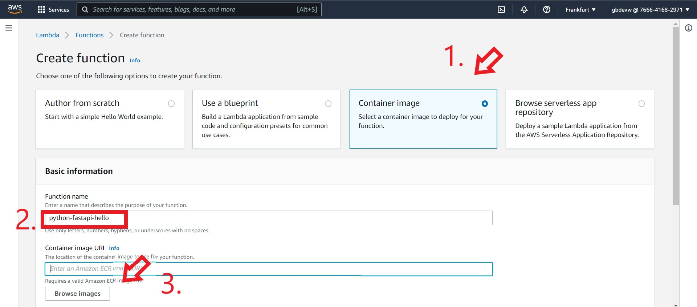

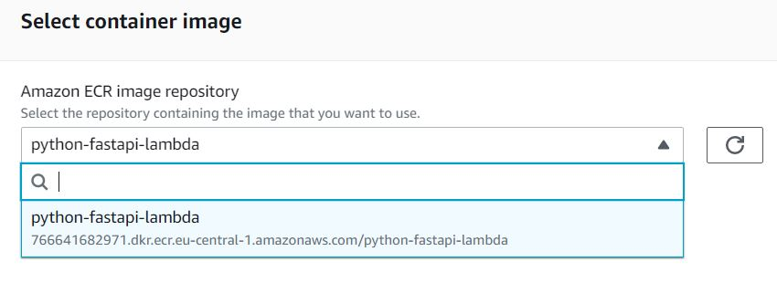


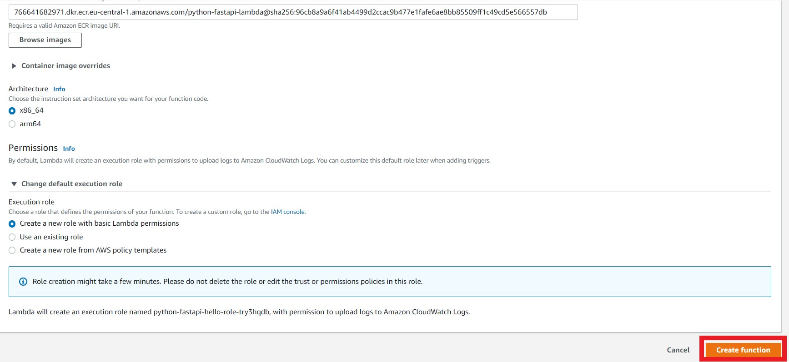


### Configure AWS API Gateway as the front door for your API running on AWS Lambda

The last major step is to configure AWS API Gateway as the front door for your API. The application defines only one resource (/hello) with a GET method. The following images show how to configure the API Gateway step by step The followng images show this step by step :

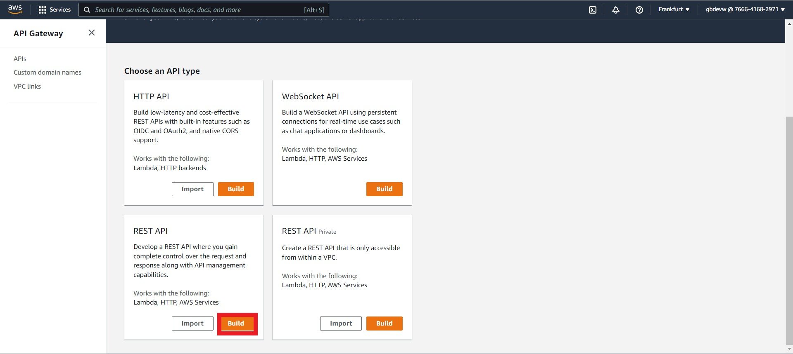

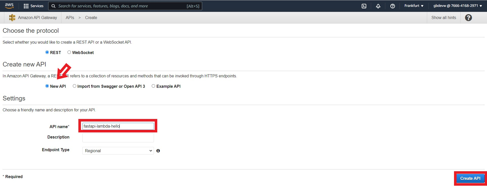


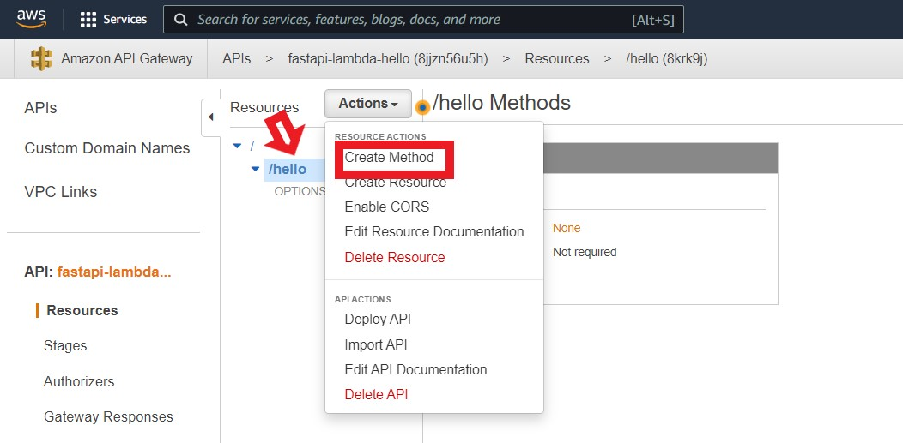

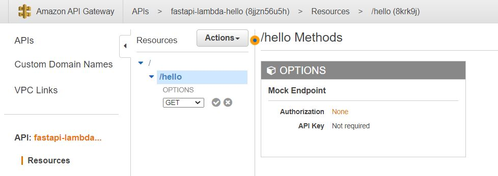

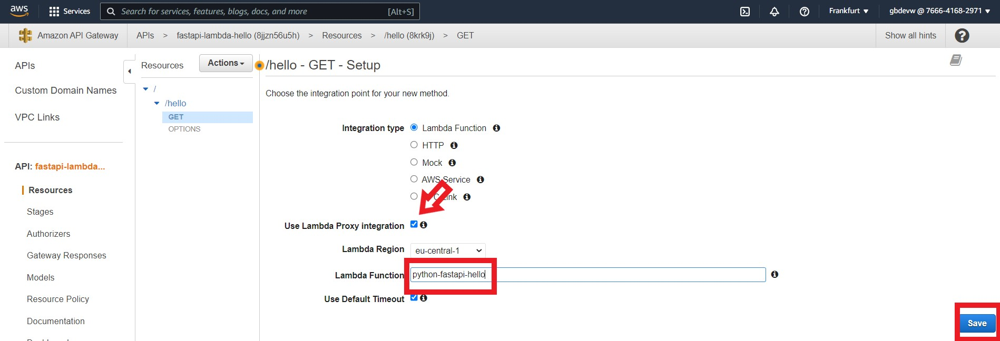


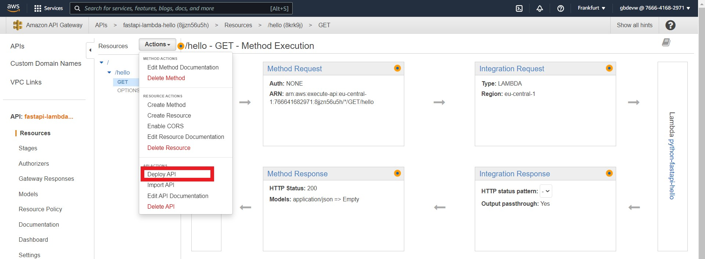

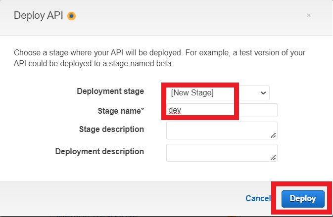


### Test the application

You can make a request to your API using the following command :

```
curl -L https://8jjzn56u5h.execute-api.eu-central-1.amazonaws.com/dev/hello
```

Or use your browser :


See the logs from Cloudwatch :

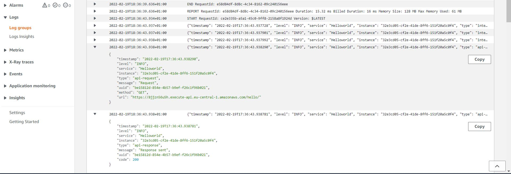

### Clean up

To clean up resources :

1. Delete the API Gateway
2. Delete the Lambda function
3. Delete the ECR repository
